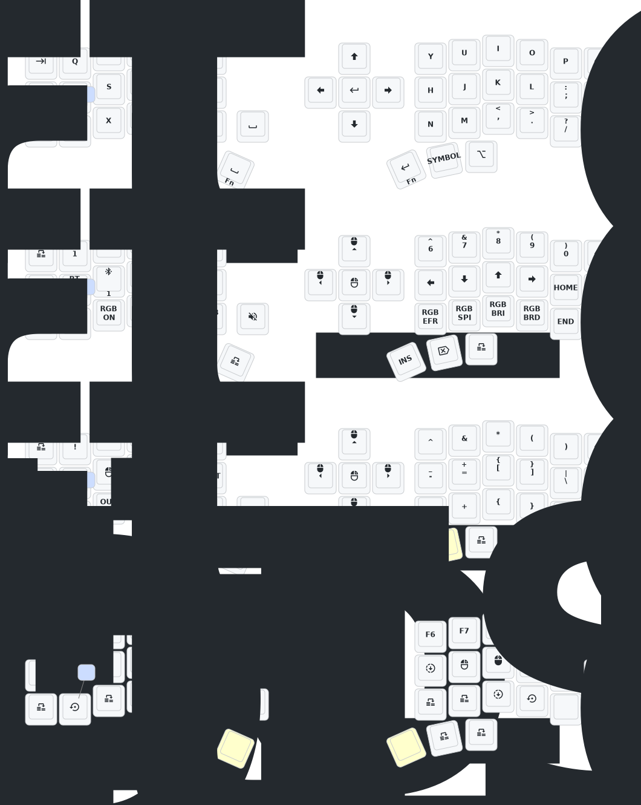

# (Eyelash Peripherals) Corne ZMK Repository

With this project, after the action of github is finished, you will have a
artifact called "firmware" with that, you can flash you device (double click on
the reset button on the back of the keyboard), and transfer the firmware to the
device.

## Keymap Diagram

